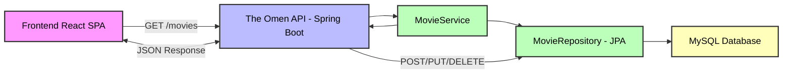

# 🔮 The Omen - API de Películas

### ⚡ API REST de alto rendimiento conectada con el frontend [`theOmen`](https://github.com/Mariaregue-spec/theOmen)

---

## 🎬 ¿Qué es The Omen?

**The Omen** es una API REST construida con Spring Boot que gestiona colecciones de películas de forma eficiente, escalable y profesional.  
Se integra perfectamente con tu frontend [`theOmen`](https://github.com/Mariaregue-spec/theOmen) para entregar una experiencia completa de CRUD de películas.

> ⚡ “No predice el futuro. Lo estructura.”

---

## 🚀 Características principales

- 📽️ CRUD completo de películas (Crear, Leer, Actualizar, Eliminar)  
- 🔍 Búsqueda por ID  
- 📊 Ordenamiento alfabético  
- 🌐 CORS habilitado  
- 💾 Persistencia con MySQL  
- ⚡ Arquitectura desacoplada y escalable  

---

## 🖥️ Demo de flujo (mockup estilizado)

---
## 🧪 Ejemplo real de respuesta

{
  
  "id": 7,
  
  "titulo": "Hereditary",
  
  "anio": 2018,
  
  "rating": 7.3,
  
  "poster": "https://...",
  
  "sinopsis": "El legado de una familia se convierte en una pesadilla."
  
}

---

## 📡 Endpoints principales

Método	Endpoint	Descripción
GET	/movies	Obtener todas las películas
GET	/movies/{id}	Obtener película por ID
GET	/movies/ASC	Ordenar películas alfabéticamente
POST	/movies	Crear nueva película
PUT	/movies/{id}	Actualizar película
DELETE	/movies/{id}	Eliminar película

---

## 🏗️ Stack tecnológico
Tecnología	Rol
Java 25	Lenguaje principal
Spring Boot 4	Framework backend
MySQL 8	Base de datos
Maven	Gestión de dependencias
JPA/Hibernate	ORM

---

## ⚙️ Instalación rápida
git clone https://github.com/Mariaregue-spec/theOmen.git
cd the-omen

Configura tu base de datos en src/main/resources/application.properties:

spring.datasource.url=jdbc:mysql://localhost:3306/the_omen
spring.datasource.username=tu_usuario
spring.datasource.password=tu_password

Ejecuta:

./mvnw spring-boot:run

API disponible en:

http://localhost:8080

---

## 🌐 Integración con Frontend theOmen
Clona o conecta tu frontend SPA theOmen
Cambia la URL base de los fetch/axios a http://localhost:8080
Todas las operaciones CRUD (GET, POST, PUT, DELETE) están listas para interactuar con tu backend
Resultado inmediato: frontend dinámico consumiendo datos reales de MySQL

---

## 📁 Estructura del proyecto
src/main/java/com/inditex/the_omen/
├── controller/      # Endpoints REST
├── service/         # Lógica de negocio
├── repository/      # Acceso a datos
└── model/           # Entidades

---

## 🧠 Modelo de datos

Campo	Tipo	Descripción
id	int	Identificador único
titulo	String	Nombre de la película
anio	int	Año de lanzamiento
rating	double	Puntuación (0-10)
poster	String	URL del póster
sinopsis	String	Sinopsis de la película

---

## 📈 Roadmap (Próximas mejoras)
 Paginación y filtros avanzados
 Autenticación JWT
 Documentación con Swagger UI
 Deploy en la nube (Heroku, Railway, AWS)
 Integración con CI/CD (GitHub Actions)

 ---
 
## 🤝 Contribuciones

Fork del repo
Crear una rama (feature/nueva-feature)
Commit de tus cambios
Pull Request

---

## 📄 Licencia

MIT License - ver el archivo LICENSE
 para más detalles.
 
---

🔮 The Omen
“No predice el futuro. Lo estructura.”
  

⭐ Dale una estrella si te ha resultado útil
🚀 Integrado con theOmen frontend
 para una experiencia completa

 
